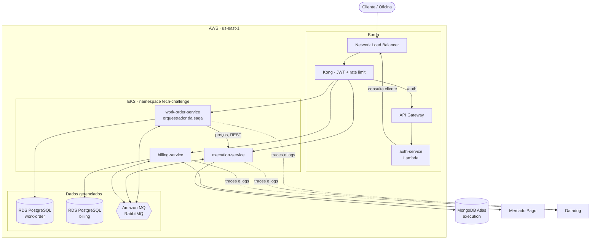
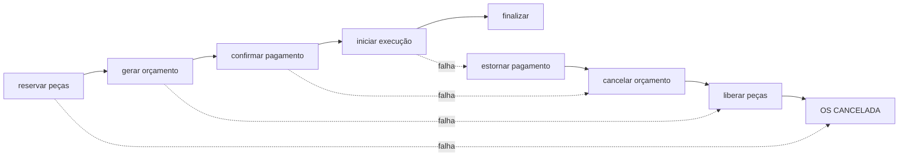

# Tech Challenge — Fase 4

Sistema de gestão de oficina mecânica reconstruído em arquitetura de
microserviços, com transação distribuída coordenada por Saga Pattern e deploy
automatizado em Kubernetes na AWS.

---

## Participantes

| Nome | RM | GitHub |
| --- | --- | --- |
| Leonardo Rodrigues Figueiredo | RM368977 | [@figueiredoleo](https://github.com/figueiredoleo) |
| Gabriel Rocha Stimamiglio | RM369366 | [@GabrielStima](https://github.com/GabrielStima) |
| Matheus Begosso Fontana | RM368963 | [@mbfontana](https://github.com/mbfontana) |
| Vinícius Luciano Navarrete Da Silva | RM369353 | [@Viiinny7](https://github.com/Viiinny7) |

O usuário `soat-architecture` foi adicionado como colaborador nos cinco
repositórios.

---

## Repositórios

| Repositório | Responsabilidade |
| --- | --- |
| [work-order-service](https://github.com/tech-challenge-workshop/work-order-service) | Ciclo de vida da OS, cadastros mestres e **orquestrador da Saga** |
| [billing-service](https://github.com/tech-challenge-workshop/billing-service) | Orçamento e pagamento (Mercado Pago) |
| [execution-service](https://github.com/tech-challenge-workshop/execution-service) | Estoque de peças, fila de execução e diagnósticos |
| [auth-service](https://github.com/tech-challenge-workshop/auth-service) | Function Serverless que emite os JWTs |
| [tech-platform](https://github.com/tech-challenge-workshop/tech-platform) | Gateway, observabilidade, manifestos Kubernetes e infraestrutura como código |

Todos com `main` protegida, alteração somente via Pull Request com checagens
automáticas.

## Vídeo

`[LINK DO VÍDEO]` — até 15 minutos.

---

## Arquitetura



Toda requisição entra pelo Kong. Nenhum serviço é alcançável de fora do cluster,
e **nenhum serviço lê o banco de outro** — os únicos caminhos entre eles são
mensagens no RabbitMQ e uma chamada REST síncrona para consulta de preços.

Diagramas de sequência da autenticação, da abertura de OS e da compensação estão
em [`docs/architecture.md`](architecture.md).

---

## Estratégia do Saga Pattern

**Escolha: Saga orquestrada, com o orquestrador no `work-order-service`.**

### Justificativa

**A decisão acompanha a posse do dado.** O status da OS *é* o estado da transação
distribuída: `AWAITING_APPROVAL` significa que o passo de orçamento está
pendente, `IN_EXECUTION` significa que o pagamento foi confirmado. O
`work-order-service` já é dono desse status e do seu histórico, e nenhum outro
serviço pode escrevê-lo. Colocar o coordenador em outro lugar separaria quem
decide o próximo passo de quem possui o estado do qual esse passo depende.

**A compensação é assimétrica e central.** Quando a execução falha, é preciso
estornar o pagamento, cancelar o orçamento e liberar as peças — nessa ordem, e
apenas os passos que de fato aconteceram. Sob coreografia essa ordenação fica
implícita em quem assina qual evento, espalhada por três bases de código. Com
orquestração, é um único método `compensate()`, e a entidade `SagaInstance`
registra quais passos foram concluídos, de modo que nada é desfeito duas vezes
nem desfeito sem ter ocorrido.

**O fluxo fica testável.** A transação inteira — caminho feliz e as quatro
ramificações de falha — é exercitada reproduzindo mensagens contra o
orquestrador, sem broker e sem banco. Isso só é possível porque as decisões estão
num lugar só.

### Trade-off assumido

O orquestrador é um ponto de acoplamento: adicionar um passo à saga significa
alterar o `work-order-service`, e ele é ponto único de falha para a coordenação.
Aceitamos isso porque a alternativa — depurar um erro de ordenação emergente
entre três serviços — é pior nesta escala. Os participantes permanecem
desacoplados: recebem comandos, respondem com eventos, e nenhum deles sabe da
existência dos outros.

Registro completo em [ADR 0001](adr/0001-orchestrated-saga.md).

### Fluxo e compensação



As ramificações são especificadas como cenários executáveis em
[`work-order-saga.feature`](https://github.com/tech-challenge-workshop/work-order-service/blob/main/tests/bdd/features/work-order-saga.feature).

---

## Divisão dos microserviços

A divisão segue as **fronteiras de contexto** identificadas no Event Storming da
Fase 1. Cada serviço é dono de um conjunto de dados que ninguém mais escreve.

| Serviço | Contexto | Por que é um serviço separado |
| --- | --- | --- |
| `work-order-service` | Atendimento | Dono do ciclo de vida da OS e dos cadastros mestres. É o contexto que orquestra os demais, e o único que pode alterar o status de uma OS. |
| `billing-service` | Financeiro | Orçamento e pagamento têm ciclo próprio, integração externa (Mercado Pago) e requisitos de auditoria distintos. Isolá-lo evita que uma indisponibilidade do provedor de pagamento afete o atendimento. |
| `execution-service` | Produção | Estoque e execução têm modelo de dados e cadência de escrita muito diferentes do restante — diagnósticos são documentos livres, e o estoque muda por reserva e baixa, não por CRUD. |

O `auth-service` **não é um microserviço**: é componente de borda, uma Function
Serverless que emite credenciais. A parte administrativa também não é um serviço
— é papel de acesso, expresso como claim de role no JWT, e cada CRUD vive no
serviço dono do dado.

### Bancos de dados

| Serviço | Banco | Justificativa |
| --- | --- | --- |
| work-order | PostgreSQL (RDS) | Dados fortemente relacionais — cliente possui veículos, OS referencia ambos e tem itens e histórico. As transições de status exigem garantias transacionais: a métrica de tempo médio deriva inteiramente do histórico. |
| billing | PostgreSQL (RDS) | Orçamento e pagamento são registros pequenos, de forma fixa, com valores inteiros exatos e máquina de estados curta. |
| execution | MongoDB (Atlas) | Diagnósticos são documentos livres — cada tipo de reparo registra informações diferentes. Execuções são lidas como agregados inteiros, sempre junto com seus diagnósticos. |

Instâncias separadas, não schemas no mesmo servidor: a credencial de um serviço
não alcança o dado do outro.

Diagramas ER e o detalhamento de cada decisão de modelagem estão em
[`docs/databases.md`](databases.md).

---

## Tecnologias

| Camada | Escolha | Justificativa |
| --- | --- | --- |
| Runtime | NestJS 11 + TypeScript | Injeção de dependência nativa, que sustenta a arquitetura de ports; tipagem estática nos contratos entre camadas. |
| Arquitetura | Clean Architecture com ports explícitos | Regras de negócio testáveis sem banco nem broker. Permitiu trocar adapters de pagamento, notificação, tracing e métricas sem tocar em use case. Ver [ADR 0006](adr/0006-clean-architecture-with-ports.md). |
| Mensageria | RabbitMQ (Amazon MQ), topic exchange | Cada passo da saga é um fato ou um comando; nenhum chamador precisa de resposta imediata, e o broker segura a mensagem se um participante estiver fora. Ver [ADR 0002](adr/0002-messaging-over-rest.md). |
| Gateway | Kong (Ingress Controller) | Ponto único de entrada, com validação de JWT e rate limit na borda. Ver [ADR 0004](adr/0004-ingress-over-gateway-api.md). |
| Autenticação | JWT HS256 emitido por Lambda | Verificação local nos três serviços, sem consulta ao emissor. Ver [RFC 0003](rfc/0003-authentication.md). |
| Nuvem | AWS — EKS, RDS, Amazon MQ, Lambda | Kubernetes é exigência do desafio; conta e créditos já existentes. Ver [RFC 0001](rfc/0001-cloud-and-compute.md). |
| IaC | OpenTofu sobre `terraform-aws-modules` | 91 recursos declarados; state em S3 com lock nativo. |
| Observabilidade | Datadog — APM, logs, dashboards | Trace distribuída atravessando os três serviços, logs JSON correlacionados por `dd.trace_id`. |
| CI/CD | GitHub Actions com OIDC | Deploy sem access key armazenada; imagem fixada no SHA do commit. |

---

## Requisitos atendidos

| Requisito | Onde verificar |
| --- | --- |
| 3 microserviços independentes, repositórios e bancos próprios | repositórios acima |
| Pelo menos 1 SQL e 1 NoSQL | 2× RDS PostgreSQL + MongoDB Atlas |
| REST síncrono e mensageria assíncrona | [ADR 0002](adr/0002-messaging-over-rest.md) |
| Nenhum serviço acessa o banco de outro | [`architecture.md`](architecture.md) |
| Saga com rollback e compensação | [feature file](https://github.com/tech-challenge-workshop/work-order-service/blob/main/tests/bdd/features/work-order-saga.feature) |
| Testes unitários em todos os serviços | badges de cobertura nos READMEs |
| Um fluxo completo com BDD | 6 cenários Cucumber no work-order-service |
| Cobertura mínima de 80% | gate no CI + badges do SonarCloud |
| SonarQube no CI | [SonarCloud](https://sonarcloud.io/organizations/tech-challenge-workshop/projects) |
| Pipeline com build, testes, qualidade e **deploy em Kubernetes** | Actions de cada repositório |
| `main` protegida com PR obrigatório | rulesets nos cinco repositórios |
| Docker e manifestos Kubernetes | Dockerfile por repositório; manifestos em [`k8s/`](../k8s) |
| Terraform | [`terraform/`](../terraform) |
| Observabilidade herdada da Fase 3 | [dashboards e monitores como código](../terraform/datadog) |
| Análise de vulnerabilidades | [`docs/security.md`](security.md) |
| Documentação arquitetural | [`docs/`](.) — diagramas, ADRs e RFCs |
| Swagger / collection Postman | `/docs` em cada serviço; [collection](../postman) |

---

## Como executar

**Ambiente completo na AWS**, do zero ao cluster funcionando:

```sh
cd terraform && make apply          # ~20 min
../scripts/bootstrap-cluster.sh     # ~8 min
../scripts/smoke-test.sh            # 23 verificações
```

Passo a passo detalhado em [`DEPLOY.md`](../DEPLOY.md).

**Ambiente local**, sem AWS: cada repositório tem `docker compose` para sua
infraestrutura, e o `tech-platform` sobe o Kong e o agente Datadog
compartilhados. Instruções no [README](../README.md).

**Percorrer o sistema manualmente**: a [collection do Postman](../postman) cobre
o fluxo completo pelo gateway — autenticação, catálogo, saga, compensação e o que
a borda rejeita. Para uma verificação automática de ponta a ponta,
[`scripts/smoke-test.sh`](../scripts/smoke-test.sh) roda 23 checagens.
