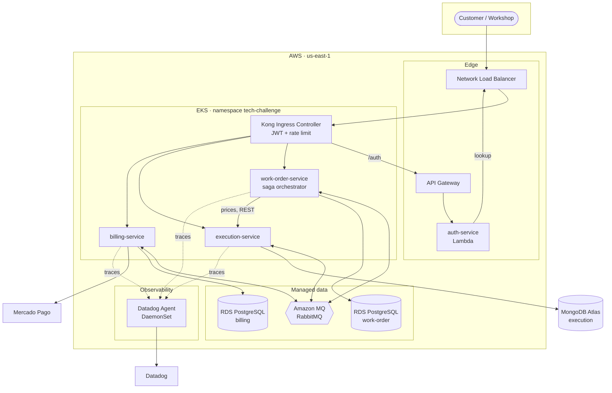
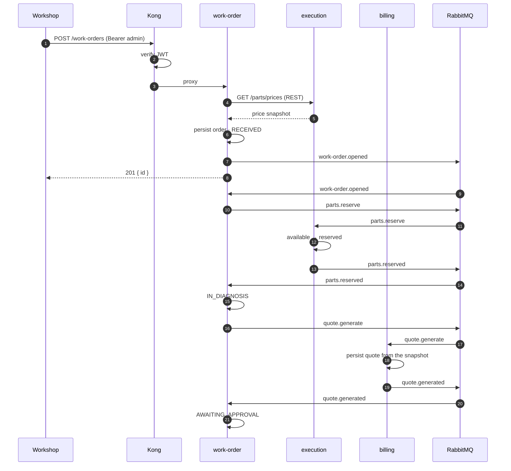
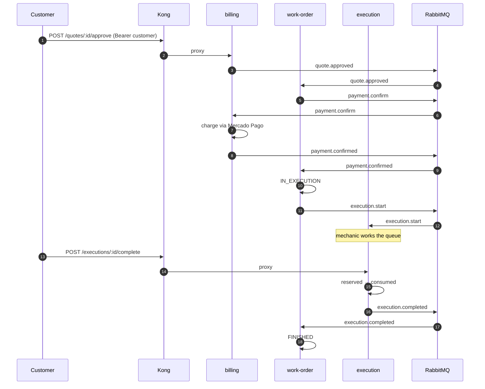
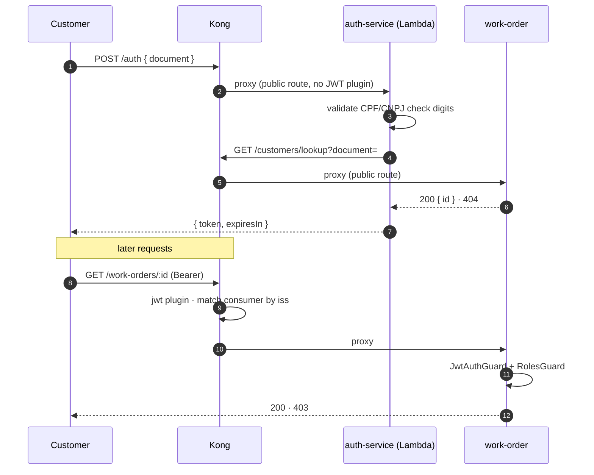
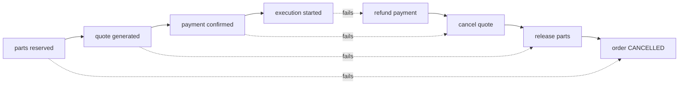
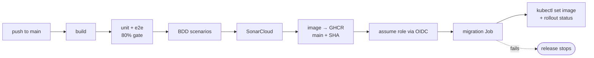

# Architecture

The system that runs, as of 2026-07-28. Diagrams are Mermaid, so they render on
GitHub and change in the same pull request as the code they describe.

## Components

Every request enters through Kong. No service is reachable from outside the
cluster, and no service reads another service's database — the only paths
between them are RabbitMQ messages and one synchronous REST call for prices.

## Opening a work order

The saga in full, including where each service writes.

The order now waits. Nothing advances until the customer decides.

## Authentication

The token is verified twice on purpose: Kong rejects anything unsigned at the
edge, and the service enforces role and ownership. A misrouted request never
reaches an unauthenticated handler.

`iss: "auth-service"` is not decorative — Kong matches the consumer credential
by that claim, and a token without it is rejected even with a valid signature.

## Compensation

Compensation runs in reverse and only undoes steps that happened. `SagaInstance`
records which ones did, so a reservation failure cancels the order without
refunding a payment that was never taken. The branches are specified as
executable scenarios in
[work-order-service's feature file](https://github.com/tech-challenge-workshop/work-order-service/blob/main/tests/bdd/features/work-order-saga.feature).

## Deployment pipeline

The rollout is pinned to the commit SHA, not to a mutable tag, so "redeploy the
previous version" names exactly one commit. `rollout status` fails the job if
the new pods never become ready.
