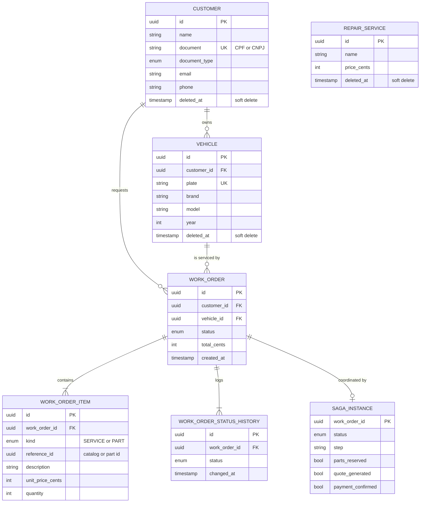
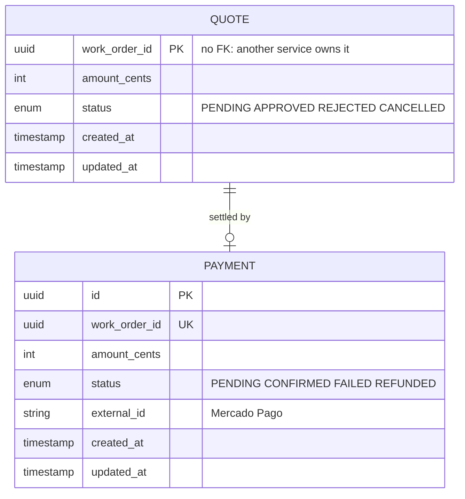
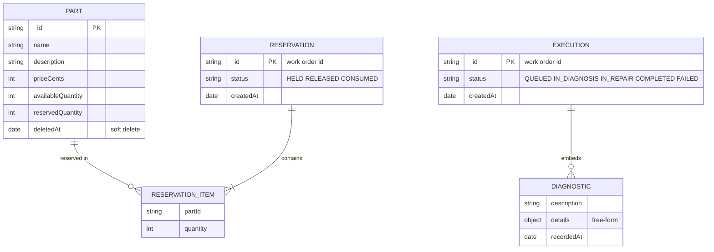

# Databases

Three databases, one per owning service. Why each is what it is, and what is in
it.

| Service | Store | Managed by |
| --- | --- | --- |
| work-order-service | PostgreSQL 17 | Amazon RDS |
| billing-service | PostgreSQL 17 | Amazon RDS |
| execution-service | MongoDB | MongoDB Atlas M0 |

Separate instances, not separate schemas on one server. Neither service's
credentials can reach the other's data, so the isolation that makes them
independently deployable is enforced by the infrastructure rather than by
convention.

---

## work-order-service — PostgreSQL

**Why relational.** This data is the reason the system exists and it is heavily
relational: a customer owns vehicles, a work order references both, and every
order has items and a status history. Those relationships are traversed on
almost every read, and they have to hold — an order pointing at a vehicle that
belongs to someone else is a bug the database itself should refuse.

The status machine also needs transactional guarantees. A transition writes the
order and appends to its history, and the two must not diverge: the average
execution-time metric is derived entirely from that history.



**`REPAIR_SERVICE` has no foreign key to `WORK_ORDER_ITEM` on purpose.** An item
stores `reference_id`, `description` and `unit_price_cents` — a *snapshot* taken
when the order was opened. Repricing a service in the catalogue must not rewrite
what a customer was quoted last month. For part items the reference points at a
document in another service's database, which no foreign key could express
anyway.

**Soft deletes** on the master data: `deleted_at` instead of a physical delete,
because a removed customer still has work orders that must remain readable. The
same rule hides `FINISHED` and `DELIVERED` orders from the active queue.

**`SAGA_INSTANCE`** is keyed by the work order and holds three booleans rather
than a step counter. Compensation reads them to undo only what actually
happened, which is also what makes redelivered messages harmless.

**Index:** `(status, created_at)` serves the queue listing, which orders by
status priority and then by age.

---

## billing-service — PostgreSQL

**Why relational.** Money. A quote and its payment are small, strongly typed
records with exact integer amounts, and the state transitions
(`PENDING → APPROVED → PAID`) benefit from the same transactional guarantees.
The volume is low and the shape never varies — there is nothing a document store
would buy here.



**`work_order_id` is the primary key of `QUOTE` and carries no foreign key.**
The work order lives in another service's database, and referencing it would be
exactly the coupling the architecture forbids. One quote per work order is the
business rule, so it doubles as the natural key.

Amounts are integer cents everywhere. Floating point currency is a defect
waiting for a rounding edge case.

---

## execution-service — MongoDB

**Why a document store.** One field decides it: a diagnostic is free-form. A
brake inspection records pad thickness in millimetres, an electrical fault
records resistance readings and a photo reference, and next month a mechanic
will want to record something nobody anticipated. Modelling that relationally
means either a column per possible finding, a key-value side table, or a JSON
column — and the third is a document store with extra steps.

Executions are also read as whole aggregates: a work order's execution with all
its diagnostics, always together, never joined against anything else. That is
precisely the access pattern a document fits.



`RESERVATION_ITEM` and `DIAGNOSTIC` are **embedded arrays**, not collections.
They have no life of their own: an item is meaningless outside its reservation,
and a diagnostic outside its execution. Embedding makes reading an aggregate a
single lookup and keeps writes atomic at the document level, which is the
guarantee the reservation logic needs.

**Stock is two counters, not one.** `availableQuantity` and `reservedQuantity`
move together: reserving shifts between them, releasing shifts back, and only
completing an execution decrements the total. A single counter could not tell a
part held for an unapproved quote from one already fitted.

---

## Why Atlas and not DocumentDB

The intent was Amazon DocumentDB, keeping everything in one cloud account. The
AWS Free Plan refuses it outright:

```
FreeTierRestrictionError: The specified cluster engine type is not available
with free plan accounts. Available engine types: [aurora-postgresql]
```

MongoDB Atlas M0 satisfies the same requirement — a managed cloud database,
provisioned as code by the same OpenTofu stack — and costs nothing. Its access
list allows a single address: the cluster's NAT gateway, which is the one route
out of the VPC. The database is reachable from the workloads and from nowhere
else.

The trade-off is one more provider in the stack. The alternative was upgrading
the account to a paid plan and losing the spend ceiling that protects a student
project.

## Migrations

The two PostgreSQL schemas are versioned with Prisma migrations and applied by a
Kubernetes Job that the deploy pipeline runs before the rollout — a failed
migration stops the release rather than following it into a rollout against a
schema that is not there.

MongoDB has no migration step. Mongoose builds the indexes it declares on
startup, and the collections are created on first write.
